# ARCHITECTURE.md

## 1. Overview

The Achievement Tracking Platform is a **Dockerized web application** built with **Remix** for frontend and backend logic. It supports **SQLite3** by default but allows JDBC-based connections to **PostgreSQL, MariaDB, or MySQL** for production. The system is designed to be **cloud-agnostic**, deployable on **AWS or any managed ecosystem** without reliance on proprietary services.

---

## 2. System Architecture

### 2.1 High-Level Architecture Diagram

```mermaid
graph TD;
    User[👤 User] -->|Request| Remix[🌐 Remix App Frontend + Backend];
    Remix -->|Read/Write| DB[📀 Database: SQLite3 / PostgreSQL / MariaDB / MySQL];
    Remix -->|Auth| AuthService[(🔑 OAuth 2.0 / JWT)];
    Remix -->|Webhook Events| Webhooks[(🔔 Webhook Handler)];
    Remix -->|API Calls| ExternalAPIs[(🌍 Third-Party Integrations)];
```

- Remix Application (Full-Stack: Handles frontend, backend, and API routes)
- Database (Supports multiple RDBMS via JDBC)
- Authentication (OAuth 2.0 / JWT)
- Webhook System (For event-driven integrations)
- External APIs (For social sharing, QR code validation, etc.)

### 2.2 User Roles

The system supports the following user roles:

- **Site Administrator**: Manages the entire platform, including organizations, system settings, and global configurations.
- **Organization Administrator**: Manages achievements, user assignments, and organization-specific settings.
- **End User**: Earns and tracks achievements, manages profile, and shares accomplishments.
- **Public Viewer**: Views publicly shared achievements without requiring authentication. These users can validate achievement authenticity through sharable links and QR codes.

## 3. Component Breakdown

### 3.1 Frontend (Remix)

- Server-rendered React for optimal performance
- Client-side interactivity where needed
- Handles API requests to the backend
- Public achievement views with verification capabilities

### 3.2 Backend (Remix API Routes)

- RESTful API to expose achievement management and tracking
- Authentication layer using OAuth 2.0 / JWT
- Handles database operations via an ORM with JDBC-based connectivity
- Webhook publisher for event-driven external integrations

### 3.3 Database Layer

- Default: SQLite3 (local, lightweight)
- Production: PostgreSQL, MariaDB, or MySQL via JDBC
- Schema Considerations:
  - Users, Organizations, Achievements, Progress Tracking, API Keys

### 3.4 API & Webhooks

Public REST API for programmatic achievement assignment and retrieval Webhook system for external notifications (e.g., when an achievement is earned)

### 3.5 Administrative Interfaces

- **Site Admin Dashboard**: Centralized interface for platform-wide management

  - User management across all organizations
  - System settings and configuration
  - Global analytics and reporting (future milestone)

- **Organization Admin Portal**: Organization-specific management tools
  - Achievement template creation and management
  - User assignment and permission controls
  - Organization-level reporting and tracking

## 4. Data Flow

### 4.1 Achievement Creation & Assignment

### 4.2 User Achievement Tracking

## 5. Deployment & Infrastructure

### 5.1 Cloud-Agnostic Deployment

- Dockerized Application for portability
- Can be deployed on AWS, GCP, or any cloud provider
- No dependencies on cloud-native services (e.g., AWS Lambda, DynamoDB)
- Uses managed databases (RDS, Cloud SQL) when available

### 5.2 Deployment Architecture

```mermaid
graph TD;
    CI/CD[🚀 CI/CD Pipeline] -->|Build & Deploy| AWS[☁️ AWS EC2, RDS];
    AWS -->|Runs| RemixApp[🌐 Remix Application Docker];
    RemixApp -->|Connects| DB[📀 Managed Database PostgreSQL/MariaDB/MySQL];
```

- CI/CD Pipeline (GitHub Actions, Jenkins, or another provider)
- Dockerized deployment to AWS EC2 or any container service
- Managed database instances for production scalability

## 6. Security Considerations

- **Authentication**: OAuth 2.0 + JWT for secure API access

  - Multi-factor authentication for administrative accounts
  - Session timeout and automatic logout mechanisms
  - JWT rotation and expiry policies

- **Authorization**: Role-based access control (RBAC) with principle of least privilege

  - Fine-grained permissions model for administrative functions
  - Organization isolation to prevent cross-organization data access

- **API Security**:

  - Rate Limiting: Protect APIs from abuse
  - Input validation and sanitization
  - API versioning to support backward compatibility

- **Data Protection**:

  - Webhook Security: Signed webhook payloads to prevent spoofing
  - Data Encryption: Enforce TLS for data in transit
  - Database encryption at rest for sensitive information
  - PII handling compliance with data protection regulations

- **Audit & Compliance**:
  - Comprehensive audit logging for security-relevant events
  - Regular security assessments and vulnerability scanning
  - Compliance documentation for relevant standards (GDPR, etc.)

## 7. Work Breakdown & Milestones

### Milestone 1: Foundation & CI/CD

✅ Core System Setup

- Remix App (Frontend + API routes)
- Authentication (OAuth 2.0, JWT)
- Database Schema (SQLite3 for dev, JDBC support for production)
- Achievement Management API (CRUD operations)
- User Progress Tracking API

✅ CI/CD & Deployment

- Dockerized environment (Ensuring local & prod parity)
- CI/CD Pipeline (GitHub Actions for automated builds & tests)

✅ Basic Testing

- Unit tests for API and core logic

### Milestone 2: Feature Expansion

\U0001F680 Enhancements & Integrations

- Webhook system (Event subscriptions)
- User profile settings (Privacy controls)
- Public Viewer role implementation and achievement sharing
- Administrative interface core functionality
- Enhanced security framework implementation
- AWS Deployment (EC2, RDS, and scalable architecture)
- Integration Testing (End-to-end API validation)

### Milestone 3: Scaling & Optimization (Post-POC)

\U0001F50D Performance & Security

- Advanced security (Webhook signing, API rate limiting)
- Public achievement sharing (QR codes, LinkedIn integration)
- Load testing & performance tuning
- Logging & monitoring setup (Prometheus, CloudWatch)
- Scalability improvements for high-volume instances

### Milestone 4: Advanced Features (Deferred)

\U0001F4CA Extended Capabilities

- Analytics system implementation (dashboard, reports, insights)
- Notification system with email integration
- API enhancements for embedding capabilities
- Advanced social integrations

## 8. Implementation Notes for Deferred Features

### 8.1 Notification System

While comprehensive notification features are deferred to Milestone 4, the system architecture will:

- Support future SMTP integration for email notifications
- Include webhook capabilities that can trigger external notification services
- Maintain extensible user preference data model for future notification preferences

### 8.2 Analytics Implementation

Analytics will be implemented after the POC phase (Milestone 4), but the architecture will:

- Include proper data collection points in core user interactions
- Use a queryable database schema that supports future analytics needs
- Separate analytics processing from core application logic to prevent performance impacts

### 8.3 Embedding Considerations

While dedicated embedding systems are not part of initial implementation:

- Public achievement verification APIs will support future embedding use cases
- Authentication system will accommodate token-based verification for embedded content
- All public achievement views will support standalone rendering for future iframe integration

## 9. Next Steps

- Define CI/CD pipeline steps (Which tests/builds to run?)
- Choose deployment strategy (EC2 vs. Fargate?)
- Set up development workflows (Branching strategy, pull request policies)
- Implement enhanced security measures as prioritized in Section 6
- Develop admin interfaces with role-based access controls
